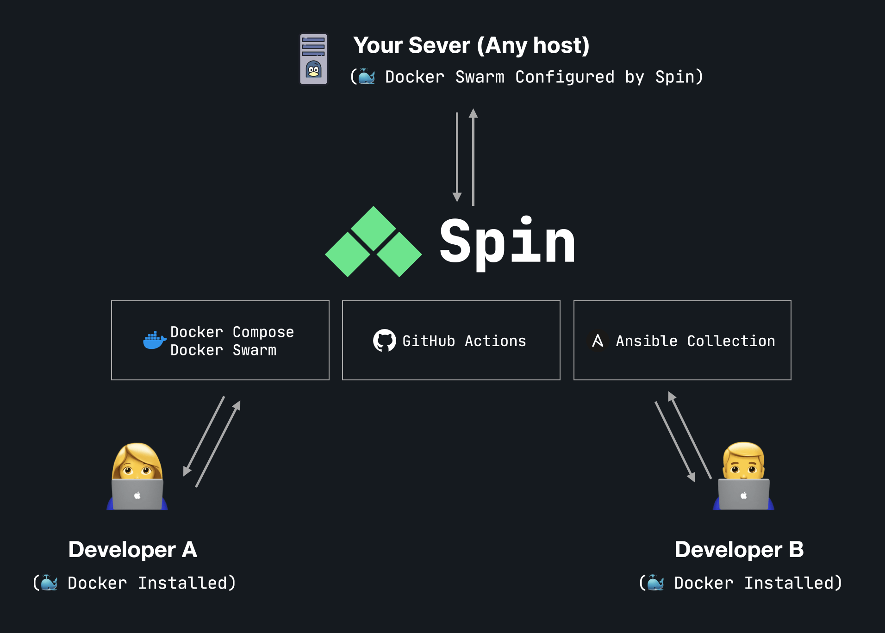

<p align="center">
		<a href="https://serversideup.net/open-source/spin/"></a>
</p>
<p align="center">
		<a href="https://serversideup.net/open-source/spin/"></a>
</p>
<p align="center">
	<a href="https://actions-badge.atrox.dev/serversideup/spin/goto?ref=main"></a>
	<a href="https://github.com/serversideup/spin/blob/main/LICENSE" target="_blank"></a>
	<a href="https://github.com/sponsors/serversideup"></a>
	<br />
	<a href="https://www.npmjs.com/package/@serversideup/spin"></a>
	<a href="https://packagist.org/packages/serversideup/spin"></a>
	<a href="https://community.serversideup.net"></a>
  <a href="https://serversideup.net/discord"></a>
</p>

# Introduction

**Stop wasting time fixing production issues you've already solved.** Spin is a bash utility that improves the user-experience for teams using Docker. Replicate any environment on any machine, regardless if they are running MacOS, Windows, or Linux. Centralize your infrastructure from a single configuration file using Docker.

Spin is a wrapper script that dramatically improves the developer experience when working with Docker. Spin uses officially supported features and best practices from Docker.

<details open>
<summary>
 <b>Features</b>
</summary> <br />

|<picture></picture>|<picture></picture>|<picture></picture>|
|:---:|:---:|:---:|
|<picture></picture>|<picture></picture>|<picture></picture>|
|<picture></picture>|<picture></picture>|<picture></picture>|

</details>

## Installation & Usage
Spin is flexible and able to be installed via:
- [macOS](https://serversideup.net/open-source/spin/docs/installation/install-macos)
- [Windows](https://serversideup.net/open-source/spin/docs/installation/install-windows)
- [Linux](https://serversideup.net/open-source/spin/docs/installation/install-linux)
- [Composer](https://serversideup.net/open-source/spin/docs/installation/install-composer)
- [NPM/Yarn](https://serversideup.net/open-source/spin/docs/installation/install-npm-yarn)

### Simple Install Command
```bash
bash -c "$(curl -fsSL https://raw.githubusercontent.com/serversideup/spin/main/tools/install.sh)"
```
### Create a new project
Spin has `spin new` to create a new project with Spin installed, as well as `spin init` to add Spin to an existing project.

```
spin new laravel {{ your project name }}
```
## Looking for more features?
We have a "[Spin Pro Laravel Template](https://getspin.pro)" that includes more features for Laravel Pros:

| Feature | Spin Basic Laravel Template | Spin Pro Laravel Template |
|---------|---------------------------|-----------|
| Price | Free | $199/once (lifetime access) |
| Automated Deployments with GitHub Actions | ❌ | ✅ |
| Local Development SSL | ❌ | ✅ (Trusted) |
| Tunnel Support | ❌ | ✅ |
| SMTP Trapping | ❌ | ✅ (Mailpit) |
| Vite over HTTPS | ❌ | ✅ |
| Databases | SQLite | ✅ MariaDB, MySQL, PostgreSQL, SQLite |
| Redis | ❌ | ✅ |
| Laravel Horizon | ❌ | ✅ |
| Laravel Reverb | ❌ | ✅ |
| Laravel Queues | ❌ | ✅ |
| Mailpit over HTTPS | ❌ | ✅ |
| Node Package Manager | `yarn` | `yarn` or `npm` |
| Support | ✅ Discord, GitHub Discussions | ✅ Private Community Support |

If you're interested in the Pro version, you visit [https://getspin.pro](https://getspin.pro) for more information.

## How Spin Works
Spin serves as a collection of open source technologies, put together in one simple experience.

<p>
	
</p>

#### Spin uses these proven technologies
- [Docker](https://www.docker.com/) (Docker Desktop, Docker Compose, Docker Swarm Mode)
- [Ansible](https://www.ansible.com/)
- Includes [GitHub Actions](https://docs.github.com/en/actions) templates (but can work with [GitLab CI](https://docs.gitlab.com/ee/ci/) too)

#### We also use a number of our other open source projects in Spin
- [Spin Ansible Collection](https://github.com/serversideup/ansible-collection-spin) - Used to provision and maintain your production server.
- [serversideup/docker-build-action](https://github.com/marketplace/actions/docker-build-action) - A simplified syntax to build and publish your Docker images with GitHub Actions.
- [serversideup/docker-swarm-deploy-github-action](https://github.com/marketplace/actions/docker-swarm-deploy-github-action) - A simplified syntax to deploy to Docker Swarm Mode via GitHub Actions.
- [serversideup/php](https://serversideup.net/open-source/docker-php/) - PHP Docker images highly optimized to work with Laravel + Spin.
- [serversideup/docker-ssh](https://github.com/serversideup/docker-ssh) - A lightweight docker image that runs SSH. This is a fantastic method on using a secure SSH tunnel into your database cluster.
- [serversideup/docker-ansible](https://github.com/serversideup/docker-ansible) - A lightweight docker image that runs Ansible.
- [serversideup/docker-github-cli](https://github.com/serversideup/docker-github-cli) - A lightweight docker image that runs GitHub CLI.

## Resources
- **[Website](https://serversideup.net/open-source/spin/)** overview of the product.
- **[Docs](https://serversideup.net/open-source/spin/docs)** for a deep-dive on how to use the product.
- **[Discord](https://serversideup.net/discord)** for friendly support from the community and the team.
- **[GitHub](https://github.com/serversideup/spin)** for source code, bug reports, and project management.
- **[Get Professional Help](https://serversideup.net/professional-support)** - Get video + screen-sharing help directly from the core contributors.

## Contributing
As an open-source project, we strive for transparency and collaboration in our development process. We greatly appreciate any contributions members of our community can provide. Whether you're fixing bugs, proposing features, improving documentation, or spreading awareness - your involvement strengthens the project. Please review our [contribution guidelines](https://serversideup.net/open-source/spin/docs/community/contributing) and [code of conduct](./.github/code_of_conduct.md) to understand how we work together respectfully.

- **Bug Report**: If you're experiencing an issue while using these images, please [create an issue](https://github.com/serversideup/spin/issues/new/choose).
- **Feature Request**: Make this project better by [submitting a feature request](https://github.com/serversideup/spin/discussions/9).
- **Documentation**: Improve our documentation by [submitting a documentation change](./docs/README.md).
- **Community Support**: Help others on [GitHub Discussions](https://github.com/serversideup/spin/discussions) or [Discord](https://serversideup.net/discord).
- **Security Report**: Report critical security issues via [our responsible disclosure policy](https://www.notion.so/Responsible-Disclosure-Policy-421a6a3be1714d388ebbadba7eebbdc8).

Need help getting started? Join our Discord community and we'll help you out!

<a href="https://serversideup.net/discord"></a>

## Our Sponsors
All of our software is free an open to the world. None of this can be brought to you without the financial backing of our sponsors.

<p align="center"><a href="https://github.com/sponsors/serversideup"></a></p>

### Black Level Sponsors
<a href="https://sevalla.com"></a>

#### Individual Supporters
<!-- supporters --><a href="https://github.com/GeekDougle"></a>&nbsp;&nbsp;<a href="https://github.com/JQuilty"></a>&nbsp;&nbsp;<a href="https://github.com/MaltMethodDev"></a>&nbsp;&nbsp;<a href="https://github.com/harrisonratcliffe"></a>&nbsp;&nbsp;<!-- supporters -->

## About Us
We're [Dan](https://twitter.com/danpastori) and [Jay](https://twitter.com/jaydrogers) - a two person team with a passion for open source products. We created [Server Side Up](https://serversideup.net) to help share what we learn.

<div align="center">

| <div align="center">Dan Pastori</div>                  | <div align="center">Jay Rogers</div>                                 |
| ----------------------------- | ------------------------------------------ |
| <div align="center"><a href="https://twitter.com/danpastori"></a><br /><a href="https://twitter.com/danpastori"></a><a href="https://github.com/danpastori"></a></div>                        | <div align="center"><a href="https://twitter.com/jaydrogers"></a><br /><a href="https://twitter.com/jaydrogers"></a><a href="https://github.com/jaydrogers"></a></div>                                       |

</div>

### Find us at:

* **📖 [Blog](https://serversideup.net)** - Get the latest guides and free courses on all things web/mobile development.
* **🙋 [Community](https://community.serversideup.net)** - Get friendly help from our community members.
* **🤵‍♂️ [Get Professional Help](https://serversideup.net/professional-support)** - Get video + screen-sharing support from the core contributors.
* **💻 [GitHub](https://github.com/serversideup)** - Check out our other open source projects.
* **📫 [Newsletter](https://serversideup.net/subscribe)** - Skip the algorithms and get quality content right to your inbox.
* **🐥 [Twitter](https://twitter.com/serversideup)** - You can also follow [Dan](https://twitter.com/danpastori) and [Jay](https://twitter.com/jaydrogers).
* **❤️ [Sponsor Us](https://github.com/sponsors/serversideup)** - Please consider sponsoring us so we can create more helpful resources.

## Our products
If you appreciate this project, be sure to check out our other projects.

### 📚 Books
- **[The Ultimate Guide to Building APIs & SPAs](https://serversideup.net/ultimate-guide-to-building-apis-and-spas-with-laravel-and-nuxt3/)**: Build web & mobile apps from the same codebase.
- **[Building Multi-Platform Browser Extensions](https://serversideup.net/building-multi-platform-browser-extensions/)**: Ship extensions to all browsers from the same codebase.

### 🛠️ Software-as-a-Service
- **[Bugflow](https://bugflow.io/)**: Get visual bug reports directly in GitHub, GitLab, and more.
- **[SelfHost Pro](https://selfhostpro.com/)**: Connect Stripe or Lemonsqueezy to a private docker registry for self-hosted apps.

### 🌍 Open Source
- **[serversideup/php Docker Images](https://serversideup.net/open-source/docker-php/)**: PHP Docker images optimized for Laravel and running PHP applications in production.
- **[Financial Freedom](https://github.com/serversideup/financial-freedom)**: Open source alternative to Mint, YNAB, & Monarch Money.
- **[AmplitudeJS](https://521dimensions.com/open-source/amplitudejs)**: Open-source HTML5 & JavaScript Web Audio Library.