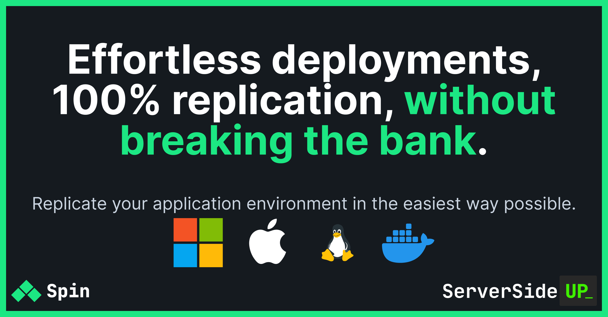

		

	
	
	
	 
	
	
	
  

Hi! We're [Dan](https://twitter.com/danpastori) and [Jay](https://twitter.com/jaydrogers). We're a two person team with a passion for open source products. We created [Server Side Up](https://serversideup.net) to help share what we learn.

### Find us at:

* 📖 [Blog](https://serversideup.net) - get the latest guides and free courses on all things web/mobile development.
* 🙋 [Community](https://community.serversideup.net) - get friendly help from our community members.
* 🤵‍♂️ [Get Professional Help](https://serversideup.net/get-help) - get guaranteed responses within next business day.
* 💻 [GitHub](https://github.com/serversideup) - check out our other open source projects
* 📫 [Newsletter](https://serversideup.net/subscribe) - skip the algorithms and get quality content right to your inbox
* 🐥 [Twitter](https://twitter.com/serversideup) - you can also follow [Dan](https://twitter.com/danpastori) and [Jay](https://twitter.com/jaydrogers)
* ❤️ [Sponsor Us](https://github.com/sponsors/serversideup) - please consider sponsoring us so we can create more helpful resources

### Our Sponsors
All of our software is free an open to the world. None of this can be brought to you without the financial backing of our sponsors.

#### 🏆 Gold Sponsor

#### Individual Supporters
<!-- supporters -->&nbsp;&nbsp;&nbsp;&nbsp;<!-- supporters -->

# What's `spin`?
**Stop wasting time fixing production issues you've already solved.** Spin is a bash utility that improves the user-experience for teams using Docker. Replicate any environment on any machine, regardless if they are running MacOS, Windows, or Linux. Centralize your infrastructure from a single configuration file using Docker.

Spin is a wrapper script that dramatically improves the developer experience when working with Docker. Spin uses officially supported features and best practices from Docker. It takes 70 character commands and simplifies them down to 7 characters.

## Features
- ✅ Works on Windows, Mac, and Linux (using Docker)
- ✅ Language independent (works with PHP, Node, Ruby, Python, etc)
- ✅ Install as project dependency or to your system
- ✅ Intelligent & Automated docker image updates on every startup
- ✅ Follows Docker standards, so there's no extra syntax to learn 

# Comparisons
We understand that spin isn't the first tool on the planet that solves the pain of managing development environments. Here is how it compares:

### Laravel Sail
We love Laravel Sail, but it focuses specifically on development. Sail uses Docker, but you won't be able to run Sail's configurations in production.

Although spin is not specifically designed for production ([read more](https://serversideup.net/open-source/spin/getting-started/introduction#do-i-run-spin-in-production)), Spin enables the system administrator to easily re-use the configurations of Spin in production if you use Docker Swarm.

You should consider `spin` over Laravel Sail if:
- You want your production environment and development environment to be 100% the same
- You want to use `spin` on other projects that do not use PHP or Laravel

### Vagrant
* Vagrant is intended for development machines only
* Vagrant is pretty heavy when it comes to image size and performance requirements

### MAMP & MAMP PRO
* You would **never** run MAMP in production

### Kubernetes
Kubernetes is great, but over complicated for most apps. If you need greater than [99.999% uptime](https://uptime.is/99.999) (and it makes business sense to pay the price for that uptime), then Kubernetes might be a great fit for you.

# Installation
We suggest reading our [Introduction & Concepts](https://serversideup.net/open-source/spin/getting-started/introduction) to learn how to install `spin.

# Documentation Site
All of our documentation is located at [https://serversideup.net/open-source/spin/](https://serversideup.net/open-source/spin/)

The docs and site are run under a different repository. [View the Docs repository →](https://github.com/serversideup/spin-site)

### Security Disclosures
If you find a critical security flaw, please open an issue or learn more about [our responsible disclosure policy](https://www.notion.so/Responsible-Disclosure-Policy-421a6a3be1714d388ebbadba7eebbdc8).
